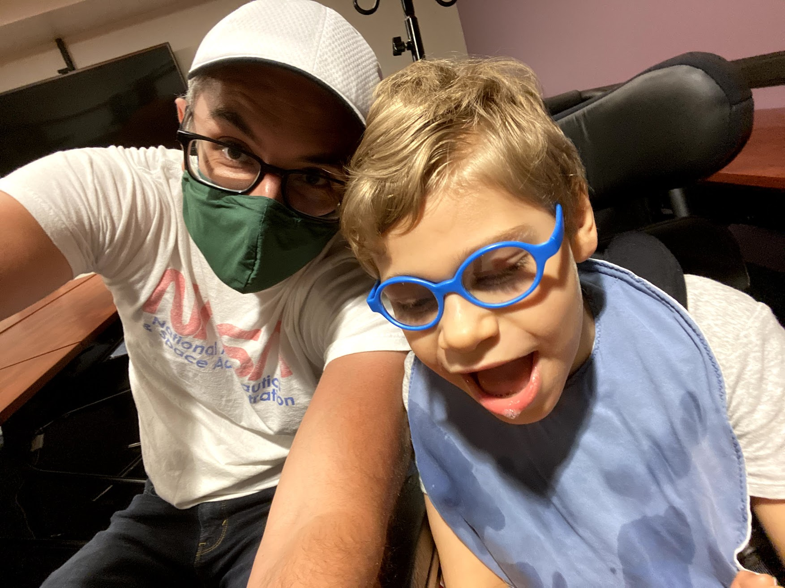

class: title-slide, left, bottom

<font size="50"> Negotiation: Some Basic Considerations </font> 

<br><br><br><br><br><br>

**Ashley I Naimi, PhD** <br> Associate Professor <br> Emory University <br>

`r icons::fontawesome("envelope")` &nbsp; ashley.naimi@emory.edu <br> `r icons::fontawesome("twitter")` &nbsp; @ashley_naimi <br> `r icons::fontawesome("github")` &nbsp; ainaimi <br>


```{r startup, include = FALSE, message = FALSE, warning = FALSE}
library(glmnet)
library(glue)

options(digits = 3, width = 110)

hexes <- function(x) {
  x <- rev(sort(x))
  bad_svg <- c("dplyr", "tidyr")
  x <- ifelse(x %in% bad_svg, paste0(x, ".png"), paste0(x, ".svg"))
  markup <- function(pkg) glue::glue('')
  res <- purrr::map_chr(x, markup)
  paste0(res, collapse = "")
}
```


---
# Negotiation

.font150[
* Disclaimer

* Should You Negotiate?

* Negotiate for What?

* Do Your Homework!

* Build a Strategy!

* How to Negotiate
]

---
# Disclaimer

.font150[
* I am not formally trained in negotiation. 

* I have negotiated three **academic** positions (two poorly, one not so poorly). 
]

---
# Should You Negotiate?

.pull-left[

<blockquote class="twitter-tweet"><p lang="en" dir="ltr">Companies that rescind offers when people try to negotiate are bullshit. Just heard of this happening to 3 separate women and I am livid. 😡</p>&mdash; EricaJoy (@EricaJoy) <a href="https://twitter.com/EricaJoy/status/616777443777490944?ref_src=twsrc%5Etfw">July 3, 2015</a></blockquote> <script async src="https://platform.twitter.com/widgets.js" charset="utf-8"></script> 

]

--

.pull-right[

<blockquote class="twitter-tweet"><p lang="en" dir="ltr">having an offer rescinded is one of the top fears of women when negotiating comes up<br><br>if you rescind her offer, you aren&#39;t ensuring future women won&#39;t negotiate. you&#39;re ensuring they won&#39;t apply.<br><br>(maybe that&#39;s the point)</p>&mdash; bletchley punk (@alicegoldfuss) <a href="https://twitter.com/alicegoldfuss/status/1100522925952647168?ref_src=twsrc%5Etfw">February 26, 2019</a></blockquote> <script async src="https://platform.twitter.com/widgets.js" charset="utf-8"></script> 

]

---
# Should You Negotiate?

.font150[

**ALWAYS NEGOTIATE**

]

--

.font150[

The one (justifiable) exception where you might choose not to negotiate is when: **(a)** your current personal or work situation is dangerous (and the job offers a clear path out of that danger); AND **(b)** there is a risk that negotiation can lead to rescindment.

]

--

.font150[

You can always ask if there's room for negotiation.

]

--

.font150[

If you choose not to negotiate, have a long game (but actually, always have a long game!).

]

--

.font150[

<span style="color: red"> It is very rare that an academic job offer is made w/o the expectation to negotiate. </span>

]

---
# Should You Negotiate?

.font150[

Consider our situation in 2015 ...

```{r cutie_pie, echo = FALSE, out.width = "600px", fig.align="center"}

```

]

---

# Negotiate for What?

.pull-left[

.font150[

* Salary

* Start-Up Funds

* Admin Assistance

* Teaching Load
]

]

.pull-right[

.font150[

* Funding Expectations

* Space

* Relocation

* Signing Bonus

]

]

--

<br><br><br>

<center>
.font150[

<span style="color: red">  All of these asks need to be calibrated to the hiring department </span>

]
</center>


---
# Do Your Homework!

.font150[

Some Salaries have to be published by law:

NIH:

https://www.fedsdatacenter.com

UNC Chapel Hill

https://www.newsobserver.com/news/databases/state-pay/article11865482.html

The ASA publishes an annual distribution of salaries for Academic Statisticians

https://www.amstat.org/ASA/Your-Career/Salary-Information.aspx

]

---
# Do Your Homework!

.font150[

There are tremendous resources out there on how to strategize:

I like Karen Kelsky's articles on negotiation:

https://community.chronicle.com/people/150-karen-kelsky/profile

https://community.chronicle.com/news/2178-the-professor-is-in-why-you-should-negotiate-every-job-offer

Books on negotiation:

https://www.google.com/books/edition/Getting_to_Yes/4bEty3TO-R8C?hl=en&gbpv=0

https://www.google.com/books/edition/Never_Split_the_Difference/RmdqCgAAQBAJ?hl=en&gbpv=0


]

---
# Do Your Homework!

.font150[

Talk to colleagues and mentors:

For me, Steve Cole (UNC) was my PhD Advisor and gave me great advice. Enrique Schisterman (NIH, now UPenn) is a mentor and friend and has experience on the hiring side of the negotiating table. I also reached out to friends with recent experience / offers from the institution that was hiring me.


]

---
# Build a Strategy!

.font150[

For instance, write up two lists: 1) what would get you to sign with no questions asked? 2) what is your walk away threshold?

]

--

Hi Tim,

It was great talking with you yesterday. I’m super excited about this opportunity. I don’t think I mentioned that I am considering another offer as well, but Emory is my top choice. I’m really confident that I’d fit in well in the department and am excited about the direction my career will take there.

After some careful thought, there’s only one thing causing some reluctance on my end. Generous as the current salary offer is, we couldn’t really make that work for the family. If you were able to offer a base salary of XXXXXX and XX% of base signing bonus, I would happily sign the offer letter (meaning, I would not come back to you with counteroffers from any other institutions, or accept offers from other institutions, even if higher). I realize this is a big ask, but it’s not too far from the range we initially discussed (I hope I didn’t misunderstand), and actually very close to the other offer I’m considering.

I would be happy to chat about any of this by phone/zoom, or continue with email, as you prefer.

Best,

Ashley

---
# Build a Strategy!

.font150[

Part of your strategy should be the ability to **reasonably justify your ask**

]

.pull-left-a-little[

```{r, echo = FALSE, out.width = "400px", fig.align="center"}

```

]

.pull-right-a-lot[
.font150[

* I have, or plan on having, a lot of children!

* I invested poorly and need money!

* I like Fabergé eggs!

* <span style="color: red"> Even serious personal circumstances </span>

]
]

---
# Build a Strategy!

.font150[

Part of your strategy should be the ability to **reasonably justify your ask**

]

.pull-left-a-little[

```{r, echo = FALSE, out.width = "400px", fig.align="center"}
knitr::include_graphics("images/drake-yep.png")
```

]

.pull-right-a-lot[
.font150[

* Funded over XX% for the last YY years

* XX many publications in high impact journals

* I have received YY awards

* Consistently excellent student feedback

]
]

---
# Build a Strategy!

.font150[

Part of your strategy should be the ability to **reasonably justify your ask**

]

.font150[

Generally, try not to distinguish yourself and justify your ask on the basis of your personal situation or complications. Instead, justify your ask on the basis of demonstrated excellence in the field and what you can contribute to the department.

]

---
# How to Negotiate

.font150[

* When hiring you, the Chair or Dean you are negotiating with is primarily responsible to the department(s) they represent. They are not your friends (even if they are).

* Do not approach the negotiation with an adversarial mindset, but be mindful of your needs and interests.

* You should not have to make life-altering decisions on the spot. Be timely with your follow-up, but know that you can ask for time to think. 

* Be grateful when you receive an offer, even if it is not what you wanted or expected.


